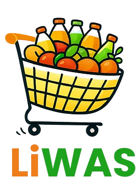

# LiWAS Customer App



A premium multi-vendor Flutter application for Food, Grocery, eCommerce, Pharmacy, and Parcel services.

## 🚀 Overview

LiWAS User App is the comprehensive consumer-facing solution for the LiWAS ecosystem. It provides a seamless shopping experience across multiple modules, including real-time tracking, secure payments, and a wide range of services from local stores and restaurants.

## 🛠 Features

- **Multi-Vendor Ecosystem**: Access Food, Grocery, Pharmacy, and eCommerce stores in one place.
- **Parcel Delivery**: Reliability for person-to-person or business-to-consumer parcel services.
- **Taxi Service**: Professional-grade rental and trip booking system.
- **Smart Search**: Intuitive category and item searching with real-time suggestions.
- **Real-time Order Tracking**: Live GPS updates for your deliveries.
- **Secure Wallet & Payments**: Integrated wallet system with loyalty points and diverse payment methods.
- **Multi-language Support**: Fully localized in English, Arabic, Spanish, and Bengali.
- **Wallet & Loyalty Points**: Earn and redeem points, manage transactions, and add funds easily.

## ⚙️ Tech Stack

- **Framework**: Flutter (v3.35.6)
- **State Management**: GetX (Forked for stability)
- **Maps**: Google Maps Flutter
- **Notifications**: Firebase Cloud Messaging & Local Notifications
- **Local Storage**: SharedPreferences & Drift (for caching)

## 🚦 Getting Started

### Prerequisites

- Flutter SDK (v3.35.6 recommended)
- Android Studio / VS Code
- Firebase Project Setup

### Installation

1. Clone the repository:
   ```bash
   git clone https://github.com/smallboy-dev/-liwas-user-app.git
   ```
2. Navigate to the project directory:
   ```bash
   cd -liwas-user-app
   ```
3. Install dependencies:
   ```bash
   flutter pub get
   ```
4. Run the application:
   ```bash
   flutter run
   ```

## 📝 Recent Updates (v2.0.0+10)

- **Backend Integration**: Updated `baseUrl` to `https://liwas.ca` for production deployment.
- **Notification Improvements**: Refactored `notification_helper.dart` for better reliability.
- **Pusher Support**: Enhanced real-time communication via `pusher_helper.dart`.
- **UI Optimizations**: Fixed wallet history and bonus banner widgets for web and mobile.

## 📄 License

This project is proprietary and confidential.

---
Developed with ❤️ by the RTI Team.
